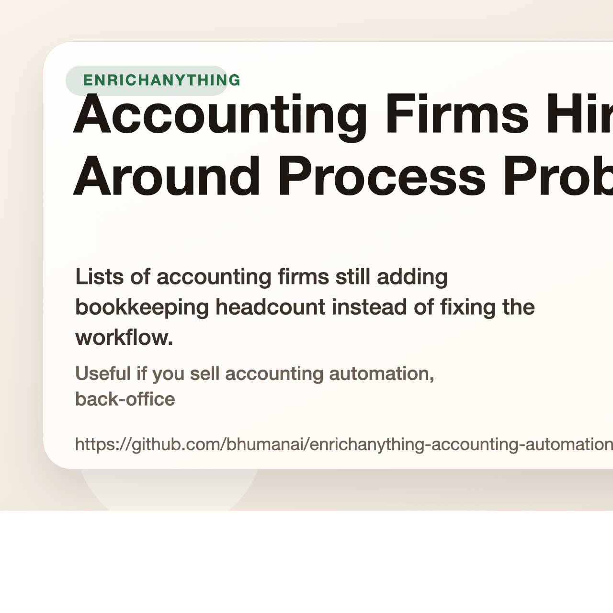

# Accounting Firms Hiring Around Process Problems

Lists of accounting firms still adding bookkeeping headcount instead of fixing the workflow.

Useful if you sell accounting automation, back-office ops, or workflow redesign.

## Start here

- Fastest first click: [Accounting firms in the US hiring bookkeepers without automation tooling (10 to 100 employees) dataset](https://www.enrichanything.com/datasets/markets/accounting-firms-us-hiring-bookkeepers-no-automation-10-100?utm_source=github&utm_medium=public_repo&utm_campaign=enrichanything-accounting-automation-gaps&utm_content=market-accounting-firms-us-hiring-bookkeepers-no-automation-10-100-dataset) (live)
- Stable link: [Accounting firms in the US hiring bookkeepers without automation tooling (10 to 100 employees) snapshot](https://www.enrichanything.com/snapshots/markets/accounting-firms-us-hiring-bookkeepers-no-automation-10-100/2026-03-23-ef8dc0ed29?utm_source=github&utm_medium=public_repo&utm_campaign=enrichanything-accounting-automation-gaps&utm_content=market-accounting-firms-us-hiring-bookkeepers-no-automation-10-100-snapshot)
- Matching note: [US accounting firms still hire around process pain before they automate it dataset](https://www.enrichanything.com/datasets/reports/us-accounting-automation-gap-10-100?utm_source=github&utm_medium=public_repo&utm_campaign=enrichanything-accounting-automation-gaps&utm_content=report-us-accounting-automation-gap-10-100-dataset)
- Cleaner web version: [https://bhumanai.github.io/enrichanything-accounting-automation-gaps/](https://bhumanai.github.io/enrichanything-accounting-automation-gaps/)
- Full product: [EnrichAnything](https://www.enrichanything.com/?utm_source=github&utm_medium=public_repo&utm_campaign=enrichanything-accounting-automation-gaps&utm_content=repo-home)

- Source product: https://www.enrichanything.com
- GitHub repo: https://github.com/bhumanai/enrichanything-accounting-automation-gaps
- Dataset hub: https://www.enrichanything.com/datasets/
- Public API docs: https://www.enrichanything.com/api/
- OpenAPI spec: https://www.enrichanything.com/openapi.json
- Last refresh: May 18, 2026
- Refresh command: `npm run refresh`

## Developer links

- Dataset hub: [EnrichAnything datasets](https://www.enrichanything.com/datasets/)
- Public API docs: [EnrichAnything API](https://www.enrichanything.com/api/)
- Node SDK repo: [enrichanything-public-api-node](https://github.com/bhumanai/enrichanything-public-api-node)
- Python SDK repo: [enrichanything-public-api-python](https://github.com/bhumanai/enrichanything-public-api-python)

## Use this repo if...

- Accounting automation agencies: Lead with the hiring signal. The wedge is that they are solving recurring process pain with more people instead of better workflow design. Start with [Accounting firms in the US hiring bookkeepers without automation tooling (10 to 100 employees)](https://www.enrichanything.com/datasets/markets/accounting-firms-us-hiring-bookkeepers-no-automation-10-100?utm_source=github&utm_medium=public_repo&utm_campaign=enrichanything-accounting-automation-gaps&utm_content=market-accounting-firms-us-hiring-bookkeepers-no-automation-10-100-dataset) (live).
- Fractional ops consultants: Use the list as a narrowed set of firms where workflow cleanup, intake fixes, or automation is easier to justify financially. Start with [Accounting firms in Canada hiring bookkeepers without automation tooling](https://www.enrichanything.com/datasets/markets/accounting-firms-canada-hiring-bookkeepers-no-automation?utm_source=github&utm_medium=public_repo&utm_campaign=enrichanything-accounting-automation-gaps&utm_content=market-accounting-firms-canada-hiring-bookkeepers-no-automation-dataset) (live).
- AI workflow builders: These lists work best when you can map specific bookkeeping or document-heavy tasks to an automation offer instead of selling generic AI. Start with [Accounting firms hiring bookkeepers without automation tooling](https://www.enrichanything.com/datasets/markets/accounting-firms-hiring-bookkeepers-no-automation?utm_source=github&utm_medium=public_repo&utm_campaign=enrichanything-accounting-automation-gaps&utm_content=market-accounting-firms-hiring-bookkeepers-no-automation-dataset) (live).

## Lists you can use now

| List | Status | Rows | Dataset | Live list |
| --- | --- | ---: | --- | --- |
| [Accounting firms hiring bookkeepers without automation tooling](markets/accounting-firms-hiring-bookkeepers-no-automation/README.md) | live | 50 | [Dataset](https://www.enrichanything.com/datasets/markets/accounting-firms-hiring-bookkeepers-no-automation?utm_source=github&utm_medium=public_repo&utm_campaign=enrichanything-accounting-automation-gaps&utm_content=market-accounting-firms-hiring-bookkeepers-no-automation-dataset) | [Live list](https://www.enrichanything.com/markets/accounting-firms-hiring-bookkeepers-no-automation?utm_source=github&utm_medium=public_repo&utm_campaign=enrichanything-accounting-automation-gaps&utm_content=market-accounting-firms-hiring-bookkeepers-no-automation) |
| [Accounting firms in Canada hiring bookkeepers without automation tooling](markets/accounting-firms-canada-hiring-bookkeepers-no-automation/README.md) | live | 34 | [Dataset](https://www.enrichanything.com/datasets/markets/accounting-firms-canada-hiring-bookkeepers-no-automation?utm_source=github&utm_medium=public_repo&utm_campaign=enrichanything-accounting-automation-gaps&utm_content=market-accounting-firms-canada-hiring-bookkeepers-no-automation-dataset) | [Live list](https://www.enrichanything.com/markets/accounting-firms-canada-hiring-bookkeepers-no-automation?utm_source=github&utm_medium=public_repo&utm_campaign=enrichanything-accounting-automation-gaps&utm_content=market-accounting-firms-canada-hiring-bookkeepers-no-automation) |
| [Accounting firms in the US hiring bookkeepers without automation tooling (10 to 100 employees)](markets/accounting-firms-us-hiring-bookkeepers-no-automation-10-100/README.md) | live | 28 | [Dataset](https://www.enrichanything.com/datasets/markets/accounting-firms-us-hiring-bookkeepers-no-automation-10-100?utm_source=github&utm_medium=public_repo&utm_campaign=enrichanything-accounting-automation-gaps&utm_content=market-accounting-firms-us-hiring-bookkeepers-no-automation-10-100-dataset) | [Live list](https://www.enrichanything.com/markets/accounting-firms-us-hiring-bookkeepers-no-automation-10-100?utm_source=github&utm_medium=public_repo&utm_campaign=enrichanything-accounting-automation-gaps&utm_content=market-accounting-firms-us-hiring-bookkeepers-no-automation-10-100) |

## Notes that explain the market

| Note | Status | Rows | Dataset | Source note |
| --- | --- | ---: | --- | --- |
| [Canadian accounting firms still hire around process pain before they automate it](reports/canada-accounting-automation-gap/README.md) | live | 34 | [Dataset](https://www.enrichanything.com/datasets/reports/canada-accounting-automation-gap?utm_source=github&utm_medium=public_repo&utm_campaign=enrichanything-accounting-automation-gaps&utm_content=report-canada-accounting-automation-gap-dataset) | [Source note](https://www.enrichanything.com/reports/canada-accounting-automation-gap?utm_source=github&utm_medium=public_repo&utm_campaign=enrichanything-accounting-automation-gaps&utm_content=report-canada-accounting-automation-gap) |
| [Small accounting firms still hire around process pain before they automate it](reports/accounting-automation-gap/README.md) | live | 50 | [Dataset](https://www.enrichanything.com/datasets/reports/accounting-automation-gap?utm_source=github&utm_medium=public_repo&utm_campaign=enrichanything-accounting-automation-gaps&utm_content=report-accounting-automation-gap-dataset) | [Source note](https://www.enrichanything.com/reports/accounting-automation-gap?utm_source=github&utm_medium=public_repo&utm_campaign=enrichanything-accounting-automation-gaps&utm_content=report-accounting-automation-gap) |
| [US accounting firms still hire around process pain before they automate it](reports/us-accounting-automation-gap-10-100/README.md) | live | 28 | [Dataset](https://www.enrichanything.com/datasets/reports/us-accounting-automation-gap-10-100?utm_source=github&utm_medium=public_repo&utm_campaign=enrichanything-accounting-automation-gaps&utm_content=report-us-accounting-automation-gap-10-100-dataset) | [Source note](https://www.enrichanything.com/reports/us-accounting-automation-gap-10-100?utm_source=github&utm_medium=public_repo&utm_campaign=enrichanything-accounting-automation-gaps&utm_content=report-us-accounting-automation-gap-10-100) |

## Need a custom cut?

Open [EnrichAnything](https://www.enrichanything.com/?utm_source=github&utm_medium=public_repo&utm_campaign=enrichanything-accounting-automation-gaps&utm_content=repo-home) if you want more columns, a fresh export, or the same pattern for a different niche.
